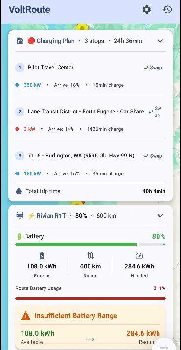
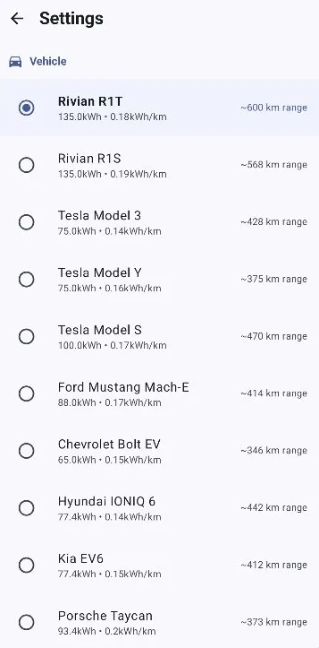
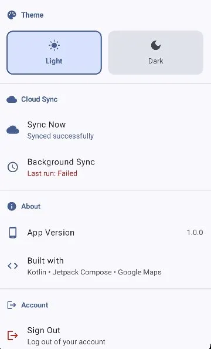
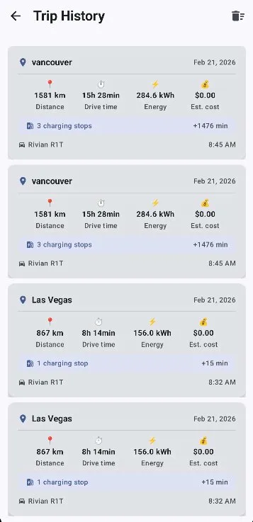

# ⚡ VoltRoute - EV Navigation & Trip Planning

<p align="center">
  
</p>

<p align="center">
  <strong>Smart route planning for electric vehicles with intelligent charging stop optimization</strong>
</p>

<p align="center">
  
  
  
  
</p>

---

##  Screenshots

<p align="center">
  
  
  
  
</p>

---

##  Features

###  **Smart Navigation**
- **Real-time route calculation** using Google Directions API
- **Interactive map** with Google Maps integration
- **Turn-by-turn navigation** with polyline route display
- **GPS location tracking** with real-time updates

### ⚡ **EV-Specific Planning**
- **Battery range calculation** based on vehicle efficiency
- **Intelligent charging stop planner** with smart algorithms
  - 60% power optimization + 40% proximity scoring
  - Optimal charging stop selection along route
- **Real-time charging station finder** (Open Charge Map API)
- **Battery state monitoring** with visual indicators (High/Medium/Low/Critical)

###  **Vehicle Profiles**
Support for 10+ popular EV models:
- Rivian R1T / R1S
- Tesla Model 3 / Y / S
- Ford Mustang Mach-E
- Chevrolet Bolt EV
- Hyundai IONIQ 6
- Kia EV6
- Porsche Taycan

Each profile includes:
- Accurate battery capacity
- Real-world efficiency ratings
- Estimated range calculations

### **Trip Management**
- **Trip history** with detailed metrics
  - Distance, duration, energy usage
  - Estimated cost per trip
  - Charging stops breakdown
- **Swipe-to-delete** gesture support
- **Trip statistics** and analytics

###  **Cloud Sync**
- **Multi-device synchronization** via Firebase Firestore
- **Real-time updates** across all logged-in devices
- **Automatic background sync** every hour (WorkManager)
- **Manual sync** option in settings
- **Offline-first architecture** - works without internet

###  **Authentication**
- **Email/Password** authentication
- **Phone number** authentication (SMS verification)
- **Secure user data** storage
- **Firebase Auth** integration

###  **User Experience**
- **Material Design 3** with dynamic theming
- **Light/Dark mode** support
- **Smooth animations** and transitions
- **Responsive UI** adapting to all screen sizes
- **Professional custom logo** and branding

###  **Offline Mode**
- **Room database** for local data caching
- **Works without internet** connection
- **Automatic sync** when back online
- Cached routes, chargers, and charging plans

---

##  Architecture

VoltRoute follows **Clean Architecture** principles with clear separation of concerns:
```
┌─────────────────────────────────────────────┐
│           Presentation Layer                │
│  (Jetpack Compose UI + ViewModels)          │
├─────────────────────────────────────────────┤
│            Domain Layer                     │
│  (Use Cases + Business Logic)               │
├─────────────────────────────────────────────┤
│             Data Layer                      │
│  ┌──────────────┐  ┌──────────────┐        │
│  │   Local      │  │   Remote     │        │
│  │   (Room)     │  │  (Firebase)  │        │
│  └──────────────┘  └──────────────┘        │
└─────────────────────────────────────────────┘
```

### **Tech Stack**

**Frontend:**
- Jetpack Compose (UI)
- Material Design 3
- Navigation Compose
- Hilt (Dependency Injection)
- Coroutines + Flow

**Backend & APIs:**
- Google Maps SDK & Directions API
- Open Charge Map API
- Firebase Authentication
- Cloud Firestore

**Local Storage:**
- Room Database
- DataStore (Preferences)

**Background Processing:**
- WorkManager (Periodic sync)
- Coroutines

**Networking:**
- Retrofit + OkHttp
- Gson

---

## Getting Started

### **Prerequisites**

- Android Studio Hedgehog (2023.1.1) or newer
- Kotlin 2.0.21+
- Min SDK 26 (Android 8.0)
- Target SDK 36

### **API Keys Required**

1. **Google Maps API Key**
   - Enable: Maps SDK for Android
   - Enable: Directions API
   
2. **Open Charge Map API Key**
   - Register at: https://openchargemap.org

3. **Firebase Project**
   - Create project at: https://console.firebase.google.com
   - Enable: Authentication (Email/Password + Phone)
   - Enable: Cloud Firestore

### **Installation**

1. **Clone the repository**
```bash
   git clone https://github.com/yourusername/voltroute.git
   cd voltroute
```

2. **Add API Keys**

   Create `local.properties` in project root:
```properties
   MAPS_API_KEY=your_google_maps_api_key_here
   OPEN_CHARGE_MAP_KEY=your_open_charge_map_key_here
```

3. **Add Firebase Configuration**
   - Download `google-services.json` from Firebase Console
   - Place in `app/` directory

4. **Build and Run**
```bash
   ./gradlew build
```
   
   Or open in Android Studio and click Run 

---

##  Project Structure
```
com.example.voltroute/
├── data/
│   ├── auth/                    # Authentication logic
│   ├── local/
│   │   ├── database/           # Room database
│   │   ├── entity/             # Database entities
│   │   ├── dao/                # Data access objects
│   │   └── repository/         # Local data repositories
│   └── remote/
│       ├── api/                # API services (Retrofit)
│       ├── firestore/          # Firestore repositories
│       └── sync/               # Cloud sync manager
├── domain/
│   ├── model/                  # Domain models
│   └── usecase/                # Business logic use cases
├── presentation/
│   ├── auth/                   # Login/Signup screens
│   ├── history/                # Trip history screen
│   ├── map/                    # Main map screen + components
│   ├── navigation/             # App navigation
│   ├── settings/               # Settings screen
│   └── splash/                 # Splash screen
├── di/                         # Dependency injection modules
├── ui/theme/                   # Material Design 3 theming
└── utils/                      # Utility classes
```

---

## 🔬 Key Algorithms

### **Charging Stop Optimization**

VoltRoute uses a greedy algorithm with weighted scoring:
```kotlin
Score = (0.6 × Power) + (0.4 × Proximity)

Where:
- Power: Charger power output (normalized 0-1)
- Proximity: Distance to route (normalized 0-1, inverted)
```

**Algorithm Steps:**
1. Calculate total energy needed for trip
2. Determine number of charging stops required
3. Divide route into segments based on battery range
4. For each segment:
   - Find chargers within radius of midpoint
   - Score each charger (power + proximity)
   - Select highest scoring charger
5. Optimize total trip time

### **Battery State Calculation**
```kotlin
Current Energy = Battery Capacity × (Battery % / 100)
Range Remaining = Current Energy / Efficiency (kWh/km)
Energy Needed = Route Distance × Efficiency
Can Reach = Range Remaining ≥ Route Distance
```

---

##  Features Breakdown

### **Charging Plan View**


- **3 charging stops** automatically calculated
- **Power levels** displayed (350kW, 3kW, 150kW)
- **Arrival battery %** at each stop
- **Charging time** estimates
- **Total trip time** with charging included
- **Swap charger** option for alternatives

### **Vehicle Selection**


- **10 EV presets** with real specifications
- **Battery capacity** and **efficiency** displayed
- **Estimated range** calculated for each vehicle
- **Visual selection** with radio buttons

### **Cloud Sync Status**


- **Manual sync** button
- **Real-time sync status** ("Synced successfully")
- **Background sync** status (Last run: Failed/Success)
- **Theme toggle** (Light/Dark mode)
- **Account management** (Sign out)

### **Trip History**


- **Detailed trip cards** with key metrics
- **Distance, duration, energy, cost** per trip
- **Charging stops** breakdown
- **Vehicle used** for each trip
- **Timestamp** of trip
- **Swipe-to-delete** functionality

---

##  Testing

### **Unit Tests**
```bash
./gradlew test
```

### **Instrumentation Tests**
```bash
./gradlew connectedAndroidTest
```

### **Test Coverage**
- Domain layer use cases
- Repository patterns
- ViewModel logic
- Database operations

---

##  Roadmap

- [ ] **Cost Tracking** - Real-time electricity cost calculations
- [ ] **Charging Notifications** - Alerts when charging complete
- [ ] **Home Screen Widget** - Battery status at a glance
- [ ] **Google Sign-In** - One-tap authentication
- [ ] **Trip Sharing** - Share routes with friends
- [ ] **Route Optimization** - Multiple route options
- [ ] **Weather Integration** - Battery impact from temperature
- [ ] **CarPlay/Android Auto** - In-vehicle integration

---

##  Contributing

Contributions are welcome! Please feel free to submit a Pull Request.

1. Fork the project
2. Create your feature branch (`git checkout -b feature/AmazingFeature`)
3. Commit your changes (`git commit -m 'Add some AmazingFeature'`)
4. Push to the branch (`git push origin feature/AmazingFeature`)
5. Open a Pull Request

---

##  License

This project is licensed under the MIT License - see the [LICENSE](LICENSE) file for details.

---

##  Author

**Your Name**
- GitHub: [@yourusername](https://github.com/yourusername)
- LinkedIn: [Your LinkedIn](https://linkedin.com/in/yourprofile)

---

##  Acknowledgments

- **Google Maps Platform** for mapping and directions
- **Open Charge Map** for charging station data
- **Firebase** for authentication and cloud sync
- **Material Design 3** for design system
- **Jetpack Compose** for modern Android UI


